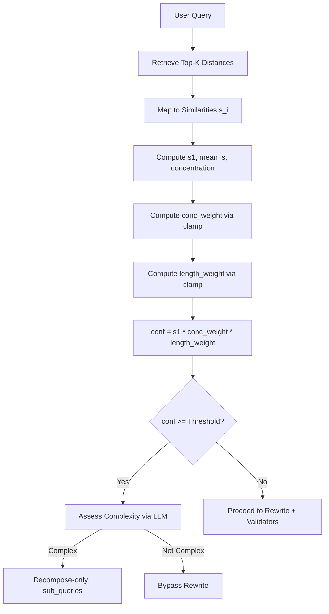
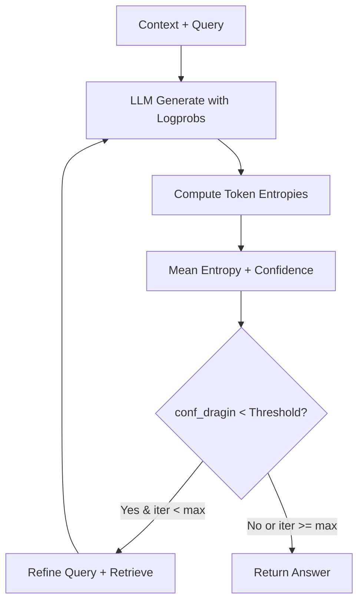

# Dokumentasi Teknis — Mekanisme Perhitungan & Algoritma RAG/DRAGIN

Dokumen ini menjelaskan mekanisme statistik dan algoritma yang digunakan dalam proyek RAG Humbet AI, termasuk perhitungan confidence berbasis retrieval, evaluasi DRAGIN (uncertainty), query refinement yang preservatif, parameter tuning, contoh numerik, diagram alur, dan strategi validasi.

## 1. Perhitungan Confidence Berbasis Statistik Retrieval

Confidence dihitung dari distribusi skor retrieval top‑K dengan penalti untuk query pendek/ambigu.

### 1.1 Definisi Similarity dari Distance

Untuk setiap hasil ke‑i, backend Chroma (cosine space) mengembalikan jarak \(d_i\). Kita memetakannya ke similarity \(s_i\) sebagai:

Persamaan (1):

$$
s_i = 1 - \min\!\left(\frac{d_i}{2},\, 1\right)
$$

Contoh numerik:

- Jika \(d_1 = 0.20\) → \(s_1 = 1 - \min(0.10, 1) = 0.90\)
- Jika \(d_2 = 0.60\) → \(s_2 = 1 - \min(0.30, 1) = 0.70\)
- Jika \(d_3 = 1.80\) → \(s_3 = 1 - \min(0.90, 1) = 0.10\)

### 1.2 Statistik Top‑K

Persamaan (2):

$$
s_1 = \max_i s_i
$$

Persamaan (3):

$$
\mathrm{mean}_s = \frac{1}{K} \sum_{i=1}^{K} s_i
$$

Persamaan (4):

$$
\mathrm{concentration} = s_1 - \mathrm{mean}_s
$$

Intuisi:

- Jika query spesifik, puncak tertinggi \(s_1\) biasanya jauh di atas rata‑rata.
- Jika query ambigu (misal satu kata umum), distribusi \(s_i\) relatif “flat”, sehingga concentration kecil.

### 1.3 Clamp & Skala Konsentrasi

Fungsi clamp membatasi nilai:

Persamaan (5):

$$
\mathrm{clamp}(x, a, b) = \min(\max(x, a), b)
$$

Bobot konsentrasi (parameter: `rq_concentration_scale`, default 0.3):

Persamaan (6):

$$
\mathrm{conc\_weight} = \mathrm{clamp}\!\left(\frac{\mathrm{concentration}}{\mathrm{rq\_concentration\_scale}},\, 0,\, 1\right)
$$

### 1.4 Penalti Panjang Kueri

Query pendek cenderung ambigu. Normalisasi panjang token:

Persamaan (7) — parameter `rq_length_norm` (default 6):

$$
\mathrm{length\_weight} = \mathrm{clamp}\!\left(\frac{L}{\mathrm{rq\_length\_norm}},\, 0.3,\, 1\right)
$$

di mana \(L\) adalah jumlah token (kata) pada kueri.

### 1.5 Rumus Akhir Confidence

Persamaan (8):

$$
\mathrm{conf} = s_1 \times \mathrm{conc\_weight} \times \mathrm{length\_weight}
$$

Jika \(\mathrm{conf} \ge \texttt{RQ_BYPASS_CONFIDENCE_THRESHOLD}\) (default 0.7) → bypass rewrite. Namun, kompleksitas tetap dinilai via LLM; jika kompleks, lakukan **decompose‑only** (refined_query = kueri asli, sub_queries dari LLM).

---

## 2. Perhitungan DRAGIN (Uncertainty‐Aware Generation)

DRAGIN mengevaluasi ketidakpastian jawaban dari logprob token.

### 2.1 Entropy per Token

Diberikan daftar top‑k kandidat dengan logprob \(\ell_j\) untuk token posisi \(t\).

Persamaan (9):

$$
p_j = \frac{e^{\ell_j}}{\sum_k e^{\ell_k}}
$$

Shannon Entropy token \(t\):

Persamaan (10):

$$
H_t = -\sum_{j} p_j \log p_j
$$

### 2.2 Entropy Rata‑Rata & Confidence

Persamaan (11):

$$
\overline{H} = \frac{1}{N} \sum_{t=1}^{N} H_t
$$

Persamaan (12):

$$
\mathrm{conf}_{\text{dragin}} = 1 - \mathrm{normalize}(\overline{H})
$$

`normalize(·)` disesuaikan dengan rentang entropi yang diamati. Jika logprobs tidak tersedia, sistem menandai fallback (mis. should_retry=True).

### 2.3 Keputusan Retry

- Parameter: `DRAGIN_THRESHOLD` (default 0.5)
- Aturan: jika \(\mathrm{conf}\_{\text{dragin}} < \texttt{DRAGIN_THRESHOLD}\) dan iter < `DRAGIN_MAX_ITERATIONS` → retry.

### 2.4 Contoh Step‑by‑Step

Top‑3 logprob: \([-0.10, -0.50, -1.20]\) → \(p \approx [0.62, 0.23, 0.15]\).

$$
H_1 = -\sum p_j \ln p_j \approx 0.94 \text{ nats}
$$

Jika rata‑rata 50 token \(\overline{H} \approx 0.85\) dan normalize\((0.85)=0.5\) → \(\mathrm{conf}\_{\text{dragin}}=0.5\).

Edge cases:

- Logprobs kosong → tandai entropy tinggi (retry).
- Jawaban kosong → entropy tinggi (retry/fallback).

---

## 3. Perhitungan Query Refinement (Preservasi Makna)

### 3.1 Similarity Embedding (Cosine)

Embedding \(E(q)\) dan \(E(q')\) dihitung dengan model embedding proyek.

Persamaan (13):

$$
\mathrm{sim}(q, q') = \frac{E(q)\cdot E(q')}{\lVert E(q)\rVert\,\lVert E(q')\rVert}
$$

Kriteria: jika \(\mathrm{sim}(q, q') < \texttt{RQ_SIMILARITY_BLOCK_THRESHOLD}\) (default 0.9) → **BLOCK** (pakai kueri asli).

### 3.2 Entitas Utama Tak Boleh Berubah

Deteksi perubahan entitas utama (peran & objek) → jika berubah → **BLOCK**.

### 3.3 Post‑Validation Retrieval

Bandingkan retrieval original vs kandidat:

- Top distance: \(d*{\text{cand,top}} > d*{\text{orig,top}} + \texttt{RQ_POSTVALIDATE_MARGIN}\) → **BLOCK**.
- Overlap sumber (Jaccard):

Persamaan (14):

$$
J = \frac{|S_{\text{orig}}\cap S_{\text{cand}}|}{|S_{\text{orig}}\cup S_{\text{cand}}|}
$$

Jika \(J < 0.2\) → **BLOCK**.

### 3.4 Jalur Bypass & Decompose‐Only

Jika confidence tinggi → bypass rewrite. Penilai kompleksitas via LLM:

- Jika kompleks → **decompose‑only** (refined_query = kueri asli, sub_queries dari LLM).
- Jika tidak → bypass biasa.

---

## 4. Parameter & Konfigurasi

| Parameter                        | Default |    Rentang | Dampak                                                            |
| -------------------------------- | ------: | ---------: | ----------------------------------------------------------------- |
| `RQ_SIMILARITY_BLOCK_THRESHOLD`  |     0.9 |   0.8–0.95 | Semakin tinggi → semakin ketat memblokir rewrite                  |
| `RQ_BYPASS_CONFIDENCE_THRESHOLD` |     0.7 |   0.5–0.85 | Semakin tinggi → makin sedikit bypass                             |
| `RQ_POSTVALIDATE_MARGIN`         |    0.15 |   0.05–0.3 | Margin toleransi degradasi top distance                           |
| `RQ_CONCENTRATION_SCALE`         |     0.3 |    0.1–0.5 | Skala normalisasi concentration; makin kecil → penalti makin kuat |
| `RQ_LENGTH_NORM`                 |       6 |       4–12 | Ambang panjang kueri untuk length_weight                          |
| `SIMILARITY_TOP_K`               |       5 |       3–10 | Ukuran daftar retrieval untuk statistik confidence                |
| `DRAGIN_THRESHOLD`               |     0.5 |    0.3–0.7 | Batas retry pada uncertainty                                      |
| `DRAGIN_MAX_ITERATIONS`          |       2 |        1–3 | Iterasi maksimum DRAGIN                                           |
| `RERANKER_MIN_SCORE`             |     0.1 |   0.05–0.5 | Ambang minimal skor reranker                                      |
| `CONTEXT_MAX_DOCS`               |       5 |        3–8 | Batas jumlah dokumen di konteks                                   |
| `CONTEXT_CHAR_BUDGET`            |    6000 | 3000–10000 | Batas karakter konteks                                            |

Best practices:

- Turunkan `RQ_CONCENTRATION_SCALE` jika banyak query pendek ambigu yang over‑confident.
- Naikkan `RQ_LENGTH_NORM` jika domain sering memakai kata pendek spesifik.
- Jaga `RQ_SIMILARITY_BLOCK_THRESHOLD` ≥ 0.9 untuk menjaga preservasi makna.

---

## 5. Contoh Implementasi

### 5.1 Confidence Retrieval

Data: \(d = [0.20, 0.60, 1.00, 1.20, 1.80]\) → \(s = [0.90, 0.70, 0.50, 0.40, 0.10]\)  
\(s_1 = 0.90\), \(\mathrm{mean}\_s = 0.52\), \(\mathrm{concentration} = 0.38\)  
`rq_concentration_scale` = 0.3 → \(\mathrm{conc_weight} = 1.0\)  
Panjang L = 4, `rq_length_norm` = 6 → \(\mathrm{length_weight} \approx 0.67\)  
Confidence: \(\mathrm{conf} \approx 0.90 \times 1.0 \times 0.67 \approx 0.60\) → tidak bypass (karena < 0.7).

### 5.2 DRAGIN Entropy (Satu Token)

Top‑3 logprob: \([-0.10, -0.50, -1.20]\) → \(p \approx [0.62, 0.23, 0.15]\)

```math
H_1 = -\sum p_j \ln p_j \approx 0.94 \text{ nats}
```

Jika \(\overline{H} \approx 0.85\), normalize\((0.85)=0.5\) → \(\mathrm{conf}\_{\text{dragin}}=0.5\).

### 5.3 Query Refinement Validation

Jika \(\mathrm{sim}(q, q')=0.88 < 0.9\) → **BLOCK**.  
Jika \(\mathrm{sim}=0.92\) dan entitas tak berubah:

- \(d*{\text{orig,top}}=0.2\), \(d*{\text{cand,top}}=0.4\), margin=0.15 → \(0.4>0.35\) → **BLOCK**.
- Jika \(d\_{\text{cand,top}}=0.3\) dan \(J=0.4\) → **KEEP**.

---

## 6. Diagram Alur

### 6.1 Confidence & Bypass



### 6.2 DRAGIN Loop



### 6.3 Query Refinement Validation

```mermaid
flowchart TD
    A[Original Query] --> B[LLM Proposes q']
    B --> C[Cosine Similarity sim(q,q')]
    C --> D{sim >= threshold?}
    D -- No --> E[BLOCK: Use q]
    D -- Yes --> F[Check Entities Changed?]
    F -- Yes --> E
    F -- No --> G[Post-Validate Retrieval]
    G --> H{TopDist/Jaccard OK?}
    H -- No --> E
    H -- Yes --> I[ACCEPT q']
```

---

## 7. Validasi & Testing

### 7.1 Unit Tests (Definisi)

- **Confidence**: daftar \(d_i\), L, `rq_concentration_scale`, `rq_length_norm` → expected conf.
- **DRAGIN**: logprobs dummy → expected entropy & retry.
- **Refinement**: similarity < threshold → BLOCK; entitas berubah → BLOCK; post‑validate mismatch → BLOCK.

### 7.2 Contoh Test (Python, pseudo‑pytest)

```python
def test_confidence_penalizes_short_flat():
    dists = [0.8, 0.85, 0.9, 0.95, 1.0]  # flat/ambiguous
    sims = [1 - min(d/2, 1) for d in dists]
    s1, mean_s = max(sims), sum(sims)/len(sims)
    concentration = s1 - mean_s
    conc_weight = max(0.0, min(concentration / 0.3, 1.0))
    length_weight = max(0.3, min(1.0, 1/6))  # 1 token
    conf = s1 * conc_weight * length_weight
    assert conf < 0.7

def test_refinement_similarity_block():
    sim = 0.88
    assert sim < 0.9  # BLOCK

def test_post_validate_jaccard_block():
    src_orig = {"A","B","C"}
    src_cand = {"D","E"}
    jacc = len(src_orig & src_cand) / len(src_orig | src_cand)
    assert jacc < 0.2  # BLOCK
```

Kriteria keberhasilan:

- Rumus deterministik terhadap input sintetis.
- Query pendek ambigu tidak memicu bypass.
- Refinement tidak mengubah entitas utama.

---

## 8. Glossary & Referensi

- **Similarity (sᵢ)**: Skor kedekatan berbasis konversi dari cosine distance.
- **Concentration**: Selisih antara \(s_1\) dan rata‑rata similarity; mengukur “peakedness”.
- **Length Weight**: Penalti/normalisasi berdasarkan jumlah token kueri.
- **DRAGIN**: Mekanisme pengukuran uncertainty dari logprobs token (Shannon entropy).
- **Jaccard**: Ukuran overlap himpunan sumber retrieval.
- **Decompose‑Only**: Mode RQ di mana kueri utama dipertahankan, hanya sub_queries yang dibuat.

Referensi:

- Shannon, C.E. “A Mathematical Theory of Communication,” Bell System Technical Journal, 1948.
- LangChain & Google Generative AI Embeddings (text‑embedding‑004) — dokumentasi resmi.
- ChromaDB cosine distance & HNSW — dokumentasi backend vektor.
