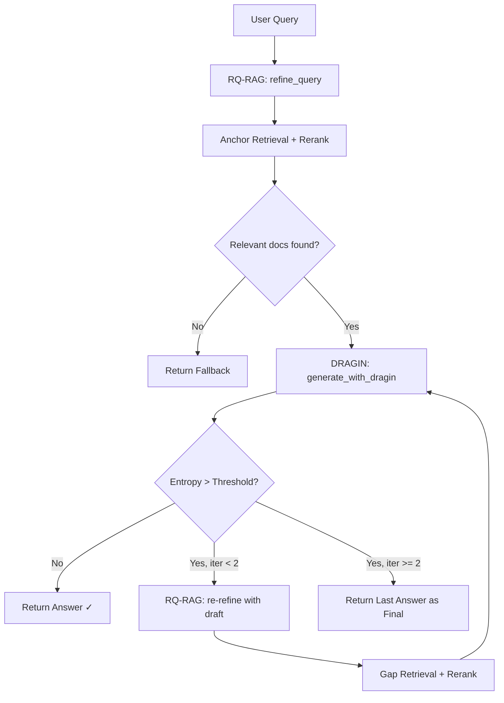

# Refactor Humbet AI: ITER-RETGEN → RQ-RAG + DRAGIN Reasoning Loop (v2)

Arsitektur baru menggabungkan **generation** dan **uncertainty evaluation** dalam satu modul DRAGIN. DRAGIN berfungsi sebagai **generator sekaligus evaluator** — jawaban di-generate via `ChatOpenAI(logprobs=True)`, lalu Shannon Entropy dihitung dari logprobs token jawaban tersebut.

## User Review Required

> [!IMPORTANT]
> **Perubahan arsitektur besar**: DRAGIN sekarang menjadi generator utama (bukan hanya probe "Ya/Tidak"). Fungsi `generate_answer` di `generator.py` tetap ada sebagai utility, tapi pipeline utama menggunakan `generate_with_dragin()` yang mengembalikan jawaban + entropy sekaligus.

> [!WARNING]
> **Reranker diganti**: Model `cross-encoder/ms-marco-MiniLM-L-6-v2` (English-only) diganti dengan `multilingual-e5-small` yang mendukung Bahasa Indonesia. Ini akan mempengaruhi relevansi konteks yang diberikan ke LLM.

## Proposed Changes

### 1. DRAGIN Module — Unified Generator + Evaluator

#### [MODIFY] [dynamic_decision.py](file:///c:/Users/NURDIN/Downloads/Nurdin/00_KULIAH/INFORMATIKA/SMT%209/SKRIPSI/Program/backend/app/rag/dynamic_decision.py)

**Perubahan fundamental**: Tambah fungsi `generate_with_dragin()` yang:
1. Menerima query + documents → generate jawaban via `ChatOpenAI(logprobs=True)`
2. Menghitung Shannon Entropy dari **seluruh token jawaban** (bukan hanya probe "Ya/Tidak")
3. Mengembalikan `DRAGINResult` berisi `answer_text`, `entropy`, `confidence`, dan `should_retry`

```python
@dataclass
class DRAGINResult:
    answer_text: str           # Jawaban yang di-generate
    entropy: float             # Shannon Entropy rata-rata dari logprobs jawaban
    confidence: float          # 1 - normalized_entropy
    should_retry: bool         # True jika entropy > threshold
    reason: str                # Penjelasan keputusan
    token_count: int           # Jumlah token yang dievaluasi

def generate_with_dragin(
    query: str, 
    documents: List[Document],
    system_prompt: str,
) -> DRAGINResult:
    """
    Generate jawaban DAN evaluasi uncertainty dalam satu panggilan LLM.
    Entropy dihitung dari logprobs token jawaban itu sendiri.
    """
```

**Fungsi lama `decide_retrieval_dragin()` dan `RetrievalDecision` dihapus** — digantikan `generate_with_dragin()` dan `DRAGINResult`.

---

### 2. Core Pipeline — Reasoning Loop

#### [NEW] [rag_pipeline.py](file:///c:/Users/NURDIN/Downloads/Nurdin/00_KULIAH/INFORMATIKA/SMT%209/SKRIPSI/Program/backend/app/rag/rag_pipeline.py)

Alur baru `run_rag_pipeline()`:



**Aturan kunci:**
- Maksimal **2 iterasi** DRAGIN. Jika entropy masih tinggi setelah iterasi ke-2, jawaban terakhir menjadi hasil final
- Setiap iterasi: DRAGIN generate → cek entropy → jika tinggi → RQ-RAG re-refine → retrieve lagi → loop
- `generate_paragraph()` **tidak dipakai lagi** — DRAGIN adalah satu-satunya generator

---

### 3. Reranker & Pruning — Fix Relevansi Konteks

#### [MODIFY] [retriever.py](file:///c:/Users/NURDIN/Downloads/Nurdin/00_KULIAH/INFORMATIKA/SMT%209/SKRIPSI/Program/backend/app/rag/retriever.py)

Tiga perbaikan:

| Masalah | Solusi |
|---|---|
| `ms-marco-MiniLM-L-6-v2` hanya efektif untuk English | Ganti ke `cross-encoder/ms-marco-multilingual-MiniLM-L6-v2` (multilingual, support Bahasa Indonesia) |
| Tidak ada filter skor minimum | Tambah `min_score` parameter — buang dokumen dengan skor reranker di bawah threshold |
| Deduplikasi tidak ada | Tambah deduplikasi berdasarkan `page_content` hash sebelum reranking |

```diff
-        model_name = "cross-encoder/ms-marco-MiniLM-L-6-v2"
+        model_name = "cross-encoder/ms-marco-multilingual-MiniLM-L6-v2"
```

#### Perbaikan `prune_context()` di pipeline baru

| Masalah Lama | Solusi |
|---|---|
| `prune_context()` menggunakan `current_draft` (teks jawaban) sebagai query reranking — ini membuat reranker mencari dokumen yang mirip *jawabannya*, bukan yang relevan dengan *pertanyaannya* | Gunakan `refined_query` sebagai query untuk reranking, bukan draft answer |

---

### 4. Generator — Updated System Prompt

#### [MODIFY] [generator.py](file:///c:/Users/NURDIN/Downloads/Nurdin/00_KULIAH/INFORMATIKA/SMT%209/SKRIPSI/Program/backend/app/rag/generator.py)

Update `build_system_prompt()`:

```diff
 def build_system_prompt() -> str:
     return (
-        "Kamu adalah asisten AI untuk chatbot edukasi Humbet. "
-        "Jawab hanya berdasarkan dokumen konteks yang diberikan. "
-        "Jika informasi yang dibutuhkan tidak ada di konteks, katakan bahwa kamu tidak tahu. "
-        "Selalu sebutkan sumber dokumen yang kamu gunakan."
+        "Kamu adalah asisten AI resmi untuk sistem Kelas Digital Huma Betang (Humbet). "
+        "Tugas utamamu adalah menjawab pertanyaan pengguna secara terstruktur, ringkas, "
+        "dan akurat berdasarkan HANYA konteks dokumen resmi yang diberikan.\n\n"
+        "Pedoman:\n"
+        "1. Jawab langsung dan to-the-point, gunakan format poin jika informasi banyak.\n"
+        "2. Setiap klaim HARUS didukung kutipan sumber, contoh: (Sumber: nama_dokumen).\n"
+        "3. Jika konteks tidak memuat jawaban, katakan: "
+        "'Tidak ada informasi tersedia untuk pertanyaan tersebut.'\n"
+        "4. JANGAN gunakan pengetahuan di luar dokumen konteks.\n"
+        "5. Gunakan bahasa Indonesia baku dan formal."
     )
```

---

### 5. Config — New Settings

#### [MODIFY] [config.py](file:///c:/Users/NURDIN/Downloads/Nurdin/00_KULIAH/INFORMATIKA/SMT%209/SKRIPSI/Program/backend/app/core/config.py)

```diff
     dragin_threshold: float = Field(default=0.5, env="DRAGIN_THRESHOLD")
+    dragin_max_iterations: int = Field(default=2, env="DRAGIN_MAX_ITERATIONS")
+    reranker_min_score: float = Field(default=0.1, env="RERANKER_MIN_SCORE")
```

---

### 6. API Layer — Import Update

#### [MODIFY] [chat.py](file:///c:/Users/NURDIN/Downloads/Nurdin/00_KULIAH/INFORMATIKA/SMT%209/SKRIPSI/Program/backend/app/api/chat.py)

```diff
-from app.rag.iter_retgen import run_rag_pipeline
+from app.rag.rag_pipeline import run_rag_pipeline
```

---

## Verification Plan

### Automated Tests
```powershell
cd "c:\Users\NURDIN\Downloads\Nurdin\00_KULIAH\INFORMATIKA\SMT 9\SKRIPSI\Program\backend"
python -c "from app.rag.rag_pipeline import run_rag_pipeline; print('Import OK')"
python -c "from app.api.chat import router; print('Router OK')"
```

### Manual Verification
1. Jalankan server → kirim query kompleks → verifikasi `debug_logs.iterations` menunjukkan "RQ-DRAGIN" bukan "ITER-RETGEN"
2. Verifikasi entropy terlihat di trace dan iterasi berhenti when entropy ≤ threshold
3. Verifikasi iterasi tidak melebihi 2 meskipun entropy tetap tinggi
